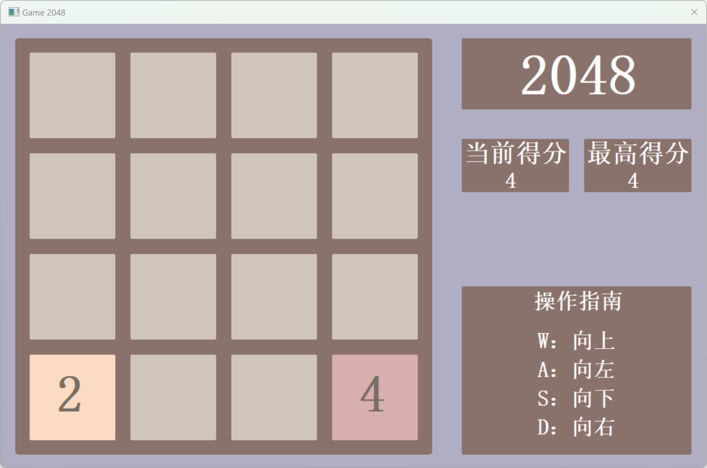

# 2048 游戏（基于 MASM32 实现）
本项目使用MASM32汇编语言实现了经典的2048游戏。游戏逻辑和游戏机制完全用汇编语言编写，展示了低级编程的高效性。游戏的目标是通过合并相同的数字块，最终达到2048。

## 游戏玩法
- 使用方向键控制方块的移动。
- 合并相同的数字块，目标是达到 2048 块。
- 每次合并后，相同的方块会相加，数值翻倍。
- 游戏结束时，无法再合并的情况下，游戏失败。

## 特性
- 经典2048玩法：与原版游戏相同，合并数字方块直到达到2048。
- 汇编语言高效实现：完全使用 MASM32 汇编语言编写，最大程度优化性能。
- 低级编程实践：该项目展示了汇编语言在游戏开发中的应用。

## 安装与运行

### 1. 安装 MASM32 编译器

你需要先安装 MASM32 编译器来进行汇编代码的编译和执行。点击以下链接下载并安装 MASM32：

[MASM32 官方下载](http://www.masm32.com/)

安装完成后，确保 `masm32` 目录已添加到系统的环境变量中，以便能够直接在命令行中使用 `ml` 等工具进行编译。

### 2. 下载并编译项目

1. 下载源代码到本地。
2. 使用 MASM32 提供的 `ml` 编译工具编译源代码。
   
   打开命令行，进入到源代码文件所在的目录，执行以下命令来编译并生成可执行文件：
   
   ```bash
   ml /c /coff 2048.asm
   link /subsystem:console 2048.obj
   ```

3. 编译成功后，将生成一个 `2048.exe` 可执行文件。

### 3. 运行游戏

运行 `2048.exe` 即可开始游戏，使用键盘的方向键进行操作。

## 游戏截图



## 常见问题

**Q: 我在运行时遇到问题，无法启动游戏。**

A: 请确保已正确安装 MASM32 编译器并且配置好了环境变量。如果有其他问题，可以在Issues中提出你的问题。

**Q: 这个版本支持哪些操作系统？**

A: 目前版本仅在 Windows 系统进行了测试。

## 贡献

欢迎大家 Fork 本项目并提出 Pull Request。你可以提交代码优化、bug 修复或者新增功能。

## 许可证

该项目采用 **GPL 3.0** 开源协议，详情请查看 [LICENSE](LICENSE) 文件。
